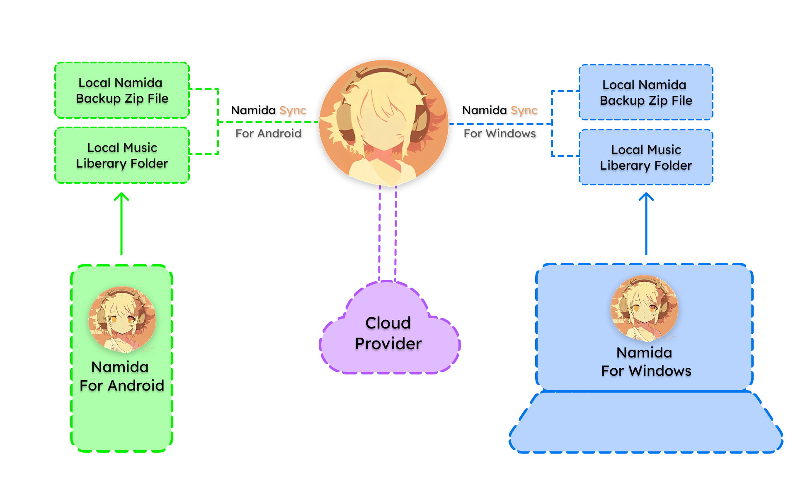

# Namida Sync

A seamless backup and restore companion app for the [Namida Music & Video Player](https://github.com/namidaco/namida), built in Flutter.  

## Table of Contents

- [Features](#features)
- [Getting Started](#getting-started)
- [How Namida Sync Works](#how-namida-sync-works)
- [Installation](#installation)
- [Documentation](#documentation)
- [Special Thanks](#special-thanks)
- [Contributing](#contributing)
- [License](#license)
- [Changelog](#changelog)

## Features

- **One-tap backup & restore** for your Namida player data and music library.
- Reliable, incremental sync and skips duplicates, handles large music libraries.
- Secure Google Drive integration.
- Auto-detects latest backup and music folders.
- **Cross-device Syncing :**

    ```
    +-------------+         +-------------+
    |             |         |             |
    |  Android 1  |<------->|  Android 2  |
    |             |         |             |
    +-------------+         +-------------+
           ↑                       ↑           
           |                       |           
           ↓                       ↓          
    +-------------+         +-------------+
    |             |         |             |
    |  Windows 1  |<------->|  Windows 2  |
    |             |         |             |
    +-------------+         +-------------+
    ```

## Getting Started

### 1. Before You Begin
- Create a backup zip file in the Namida app by using its built-in backup feature to generate a backup zip file. Be mindful with what you include while creating the backup.  
- Make sure Namida Sync shows the correct Namida backup and music folder paths. If not, pick them manually.

### 2. Back Up Your Namida Environment to Google Drive
- Tap **Sign in with Google** (if you haven’t already).
- Tap the **Backup** button. Namida Sync will upload your Namida backup zip and music files to Google Drive.

### 3. Restore Your Data
- Tap **Restore** to download your backup zip and music files from Google Drive.
- If asked, choose where to save your restored folder, you will get two choices :
    - Pick an existing location of the currently restoring music folder if it already exists on your device.
    - Pick a parent folder on your device to restore the currently restoring music folder, as a subfolder inside it.
- After the restore finishes, open the Namida app : 
    - Use its restore/import feature to load your backup zip file.
    - Make sure that the restored music folder is listed in Namida's included paths list.
- Note : 
    - Restoring the backup zip file can overwrite the paths for backup and included music folder, if you restore "settings" as well then you'll need to overwrite the backup and music folder paths.
    - So restore settings only for the first time. That's why, again, be mindful with what you include in the backup zip file.

## How Namida Sync works?

### 1. Folder Detection & Validation
- **Auto-detects** default folders :
  - Android : 
    - `/storage/emulated/0/Namida/Backups` 
    - `/storage/emulated/0/Music`
  - Windows : 
    - `C:/Namida/Backups`
- **Custom folders :** Easily select your own backup and music folders using the built-in folder picker functionality.
- **Validation :** Checks for backup zip and music files before syncing.

### 2.Google Drive Integration

- **Sign in :** Firebase Authentication.
- **[Drive API](https://developers.google.com/workspace/drive/api/guides/about-sdk) :** Uploads/downloads files and manages folders.
- **Structure :** All data goes inside `NamidaSync/` on your Google Drive.
  - `NamidaSync/MusicLibrary/` : Stores your music files, preserving folder structure.
  - `NamidaSync/Backups/` : Stores your Namida backup zip files.
  - `NamidaSync/Manifests/` : Stores manifest json files for each backup .

### 3. Backup & Restore Workflow

- **Backup :**
  1. Finds your latest backup zip and music folders on your device.
  2. Uploads backup zip to `NamidaSync/Backups/`.
  3. Uploads music files to `NamidaSync/MusicLibrary/` (preserves nested-folder structure).
  4. Generates and uploads a manifest.

- **Restore :**
  1. Downloads and reads the manifest.
  2. Checks platform compatibility (Android-Android, Windows-Windows and Android-Windows).
  3. Restores backup zip and music folders (asks for location if needed).
  4. Downloads files, shows progress, skips duplicates, handles errors.

### 4. Workflow illustration (It all began with this sketch)



## Pro Tips

- **Music Liberary Folder Structure :** Put all your music folders into a single parent folder and sync that parent folder only, for easier backup and restore.
- **Before restoring on a new device or after a reset :** Make sure your latest backup is on Drive.
- **Android permission issues?** Try re-picking folders and granting permissions again in app settings.
- **Backup/Restore issues?** Try signing out of your Google account, then sign back in.
- **Large music library?** Use a stable internet connection. If a backup/restore is interrupted, don’t worry, Namida Sync skips duplicates on next backup/restore.

## Installation

See the [Releases page](https://github.com/010101-sans/namida_sync/releases) for all downloads.

- **Android :**  
  - If you are not sure which version to download, then [download Universal APK](https://github.com/010101-sans/namida_sync/releases/download/v1.0.0/app-release.apk)  
  - If you know your device's architecture, you can download a specific APK from the [Releases page](https://github.com/010101-sans/namida_sync/releases).

- **Windows :**  
  - [Download the Windows ZIP file](https://github.com/010101-sans/namida_sync/releases/download/v1.0.0/NamidaSync-Windows-v1.0.0.zip), extract it to a folder of your choice, and then run `namida_sync.exe` inside the extracted folder.


#### **⭐️ Star this repo if you liked Namida Sync**  


## Documentation

- See the [docs/README.md](docs/README.md) for a full index of technical and design documentation created during development of Namida Sync.
- See the [docs/FAQ.md](docs/FAQ.md) for Common questions and troubleshooting tips for users and contributors.

## Special Thanks

- [@MSOB7YY](https://github.com/MSOB7YY), the creator of [Namida](https://github.com/namidaco/namida) for the original and inspiring project.
- [Flutter Team](https://github.com/flutter/flutter) for the amazing framework.
- All open source package maintainers and contributors who make Namida Sync possible.

## Contributing

- Found a bug or have a feature request? [Open an issue](../../issues)
- Want to help out? See our [CONTRIBUTING.md](CONTRIBUTING.md)
- Please read our [Code of Conduct](CODE_OF_CONDUCT.md)

## License

This project is licensed under the [MIT License](LICENSE).

## Changelog

See [CHANGELOG.md](CHANGELOG.md) for release notes and version history.

backup restore music-library sync open-source
 